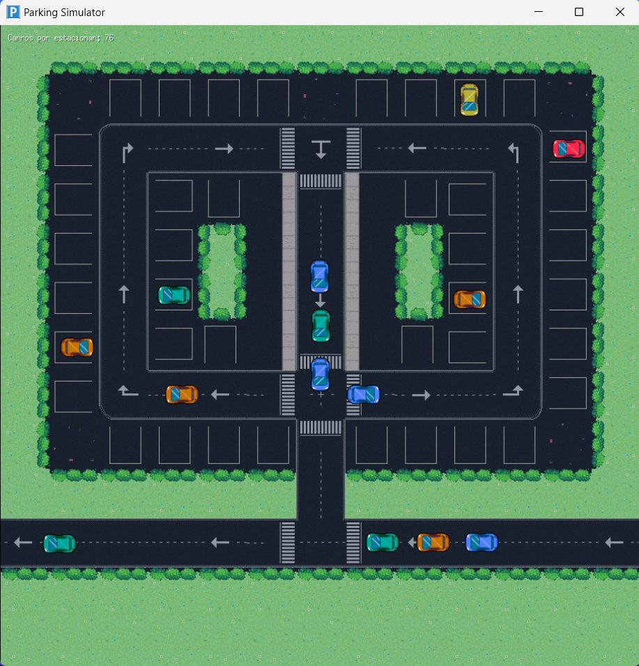

# Simulador de Estacionamiento Concurrente 🚗

Un simulador escrito en Go que modela el comportamiento de un estacionamiento, gestionando autos, espacios de estacionamiento y rutas mediante concurrencia, goroutines y canales.



## 🚀 Características

- **Simulación de tráfico:** Autos que se mueven a través de rutas definidas hasta encontrar un espacio de estacionamiento disponible.
- **Concurrencia:** Uso eficiente de goroutines y canales para manejar múltiples autos de forma simultánea.
- **Mapas personalizables:** Define rutas y espacios de estacionamiento en un mapa interactivo.

## 🛠️ Requisitos

- Go 1.20 o superior
- [Ebiten](https://ebitengine.org/) para renderización gráfica.
- Sistema operativo compatible con Go (Linux, macOS, Windows)

## 📦 Instalación

1. Clona el repositorio:

   ```bash
   git clone https://github.com/GJZ26/Parking-Simulator.git
   cd Parking-Simulator
   ```

2. Instala las dependencias necesarias:

   ```bash
   go mod tidy
   ```

3. Compila y ejecuta el programa:

   ```bash
   go run ./src/main.go
   ```

## 🗺️ Uso

1. Modifica el mapa inicial con espacios de estacionamiento y rutas en el archivo de configuración (`src/assets/map/editable/parking-slot.tiled-project`) con [Tiled Editor](https://www.mapeditor.org/).
2. Ejecuta el simulador. Verás cómo los autos siguen las rutas definidas y buscan estacionamiento disponible.
3. Observa el resultado en la terminal o en la interfaz gráfica.
